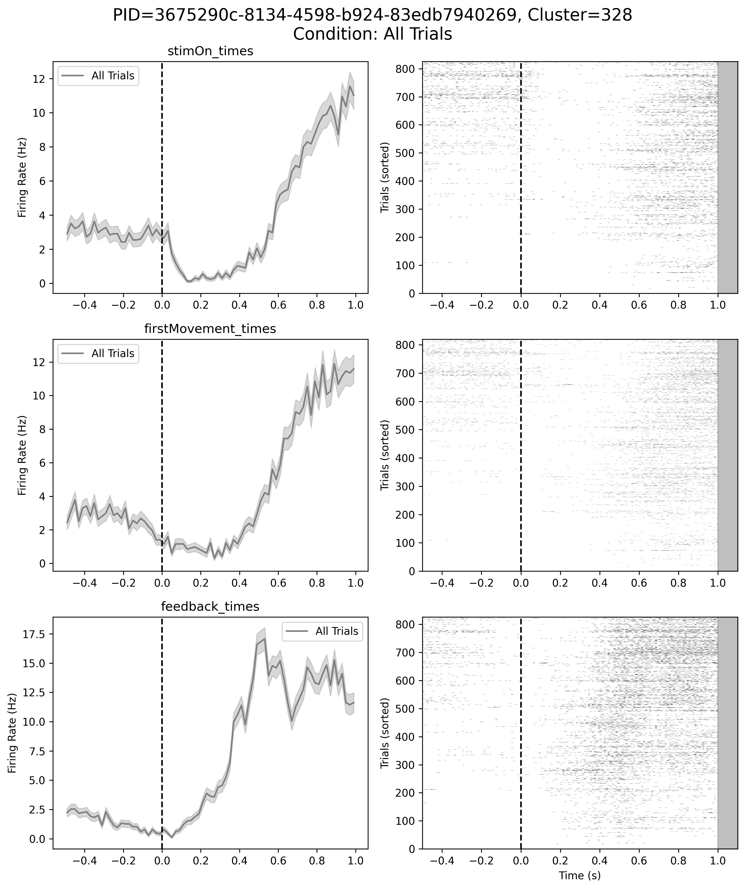
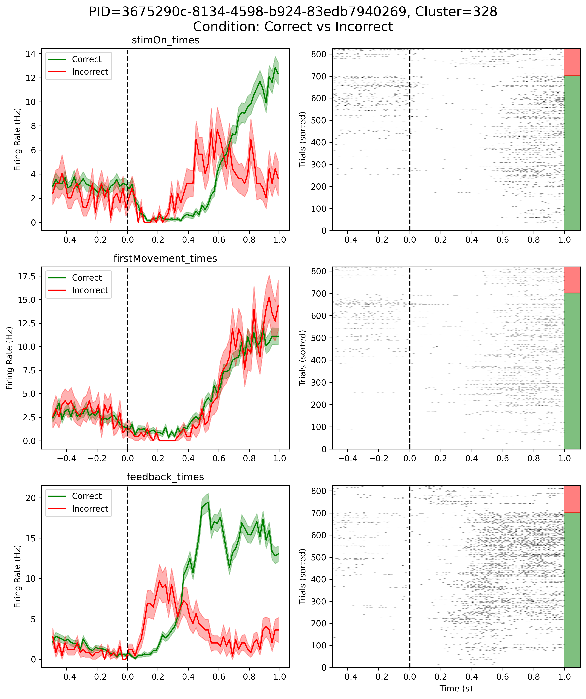
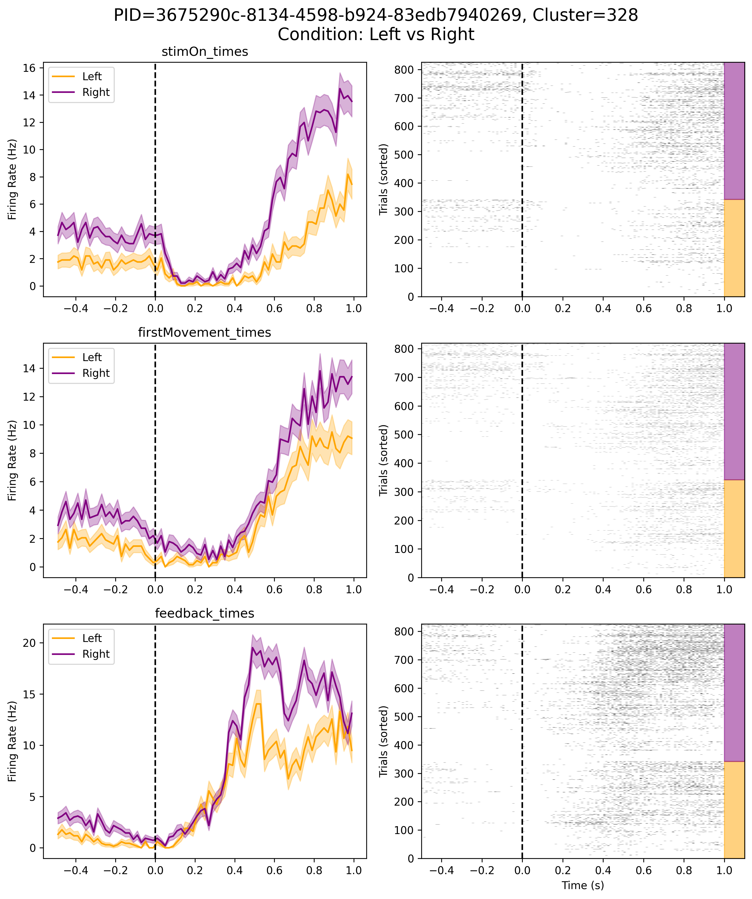

# Hierarchical Latent Variable Models for Neural Data Analysis

## Authors:
- **Vaibhav Bommisetty** (vbommisetty@ucsd.edu)  
- **Beomseuk Seo** (bseo@ucsd.edu)  
- **Mentor: Mikio Aoi** (maoi@ucsd.edu)  

---

## Summary:
How does the brain make decisions? This project dives into the neural mechanisms behind decision-making by analyzing brain activity in mice performing a visual decision-making task. Using advanced statistical models, we identify patterns in neural activity that correspond to specific behaviors, such as responding to visual stimuli or making choices. Our goal is to uncover how different brain regions work together to transform sensory information into actions, providing insights into the brain's decision-making process.

---

## Introduction:
Decision-making is a fundamental part of life, from choosing what to eat to making complex decisions at work. But how does the brain make these decisions? To answer this, we study the **superior colliculus (SC)**, a mid-brain region involved in processing sensory information and guiding actions. Specifically, we focus on two subregions of the SC—**SCdg** and **SCiw**—which play key roles in integrating sensory inputs and generating motor outputs. By analyzing neural activity in these regions, we aim to uncover how the brain encodes decision-making processes.

  <iframe
    src="images/Superior%20Colliculus%20Slide5ff.jpeg"
    style="width: 100%; height: 420px; /* Adjust height as needed, or consider aspect-ratio */ border: none;"
    title="Sagittal view of the human brain highlighting the superior colliculus (Credit: Anatomist90)"
    loading="lazy">
    
Your browser does not support iframes. View image: <a href="images/Superior%20Colliculus%20Slide5ff.jpeg">Superior Colliculus</a>

  </iframe>

  <em>Image: Sagittal view of the human brain highlighting the superior colliculus. While this project uses mouse data, the SC is a conserved structure across mammals. Credit: Anatomist90.</em>

---

## Background:

### Decision-Making Task:
Mice were trained to perform a visual decision-making task. They were shown visual patterns (striped gratings) on either the left or right side of a screen and had to turn a steering wheel in the corresponding direction to receive a reward. Correct choices were rewarded with a drop of sugar water, while incorrect choices resulted in a timeout. This task allowed us to study how neural activity changes during sensory processing, decision-making, and feedback.

### Data:
We used data from the **International Brain Laboratory (IBL)**, one of the largest collections of neural recordings in neuroscience. The dataset includes recordings from 139 mice, with activity from over 600,000 neural units captured using advanced **Neuropixels probes**. These probes allow us to measure the activity of hundreds of neurons simultaneously, providing a detailed view of how different brain regions work together.

### Interactive Data Exploration:
The frame below allows you to explore the different probes and even view a video of the trials. The probe that is currently selected is the probe that gathered data for the SCdg brain region.

    <iframe 
        src="https://viz.internationalbrainlab.org/app?dset=bwm&pid=069c2674-80b0-44b4-a3d9-28337512967f&tid=0&cid=-1&qc=0&spikesorting=ss_original" 
        style="width: 100%; height: 100%; border: none;"
        allow="accelerometer; autoplay; clipboard-write; encrypted-media; gyroscope" 
        allowfullscreen>
    </iframe>

*Courtesy of the International Brain Lab (IBL). [https://viz.internationalbrainlab.org/](https://viz.internationalbrainlab.org/)*

---

## Methods:
To analyze the data, we used a combination of statistical and machine learning techniques:

1. **Sensitive Cluster Identification:** We identified neurons that respond strongly to specific events, such as the appearance of a visual stimulus or the start of a movement. This was done using permutation testing, a method that compares observed neural responses to random shuffles of the data to determine significance.
2. **Latent Variable Modeling:** We used Probabilistic Canonical Correlation Analysis (PCCA) to uncover hidden patterns in the neural data. PCCA is a statistical method that identifies shared variability between different sets of data, allowing us to model how neural activity relates to behavior.

---

## Results and Conclusion:

### Plots:

<!-- START OF CARUSEL -->

    

        
        

            Neural activity of Cluster 328 across all trials.
            

    

    

        
        

            Cluster 328 activity: comparing correct vs. incorrect trials.
            

    

    

        
        

            Cluster 328 activity: comparing responses to left vs. right stimuli.
            

    

    <a class="prev" onclick="plusSlides(-1)">&#10094;</a>
    <a class="next" onclick="plusSlides(1)">&#10095;</a>

    

        
        
        
    

<!-- END OF CARUSEL -->

### Conclusion:
Our analysis revealed distinct patterns of neural activity in the SCdg and SCiw regions during decision-making. For example, certain neurons responded more strongly to visual stimuli on the left versus the right, while others were more active during correct versus incorrect choices. Using PCCA, we were able to identify shared patterns of activity that correspond to specific behaviors, such as turning the wheel or receiving feedback.

However, our results also highlighted some limitations. While PCCA is effective at capturing linear relationships, it struggles with more complex, nonlinear dynamics. This is where methods like GPFA could be more powerful, as they can model smooth, time-varying patterns in neural activity.

---

## Future Work:
To build on this research, we plan to:
1. Explore **Gaussian Process Factor Analysis (GPFA)** to better capture nonlinear relationships and temporal dynamics in neural data.
2. Investigate other brain regions involved in decision-making to understand how different areas work together.
3. Develop more efficient computational methods to handle the large-scale data generated by modern neuroscience experiments.

By combining advanced statistical models with high-resolution neural recordings, we hope to uncover new insights into how the brain makes decisions and ultimately contribute to a deeper understanding of brain function.

---
